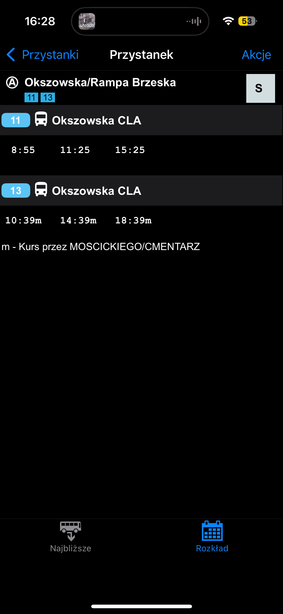
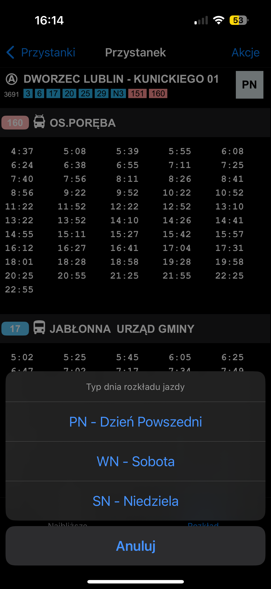
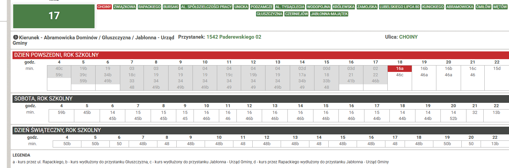

This table stores departure schedule for each routeNumber-routeVariant-dayType combination.

## Original Structure

```ts
export const _departureSql = {
    typ_dnia: 'PN',
    war_trasy: 'A',
    id_krn: 426545,
    bus_stop_id: 570,
    numer_lini: '160',
    odjazdy:
        '18120,,19920,,21540,,22440,,23340,,24180,,25080,,25980,,26880,,27780,,28680,,29580,,30720,,32520,,34320,,36120,,37920,,39720,,41520,,43320,,45120,,46920,,48720,,49620,,50520,,51420,,52320,,53220,,54120,,55020,,55920,,56820,,57720,,58800,,60780,,62580,,64380,,66180,,67980,,69780,,71640,,73440,,75300,,77100,,78900,,80700,',
    lp_przyst: 1,
};
```

## Comment

Column `odjazdy` holds s departure times for example `64080,,80400,,84480,`.

Yes this is double delimited comma string with one trailing comma. You are not seeing it wrong.

Numbers in this string are seconds since midnight so this would convert to human readable `17:48,22:20,23:28` in 24-hour system.

There is one major caveat - only some of the route variants have departures. Meaning that by default in offline mode (and in online mode when vehicle is not assigned) all variants are "merged" into one.

City operator needs to opt-in to using `uwagi` table to enable this feature, but header is still not correct. Then example of `odjazdy` would look like `64080,m,80400,,84480,`, where `m` is from `uwagi` table.



For example - route 17 goes from `Paderewskiego` to either one of `Abramowicka Dominów` / `Głuszczyzna` / `Jabłonna - Urząd Gminy` and also has a 2 variants through `Rapackiego` street. In total 5 variants, but all departures are as if they were one.



To illustrate below is screenshot from ZDTM's website that has all variants correctly labeled.



## Parsed Type

```ts
export type HH = `${0 | 1}${number}` | `2${0 | 1 | 2 | 3}`;
export type MM = `${0 | 1 | 2 | 3 | 4 | 5}${number}`;
export type TimeString = `${HH}:${MM}`;

export type DepartureTime = {
    seconds: number;
    hour: number;
    minute: number;
    label: TimeString | SomeOtherString;
};

export type DepartureTimeInfo = DepartureTime & { notice: string };
export type Departure = {
    destinationId: Route['id'];
    dayType: Day['type'];
    route: {
        number: Route['number'];
        variant: Route['variant'];
    };
    stopIdSip: Stop['idSip'];
    stopNumberOnRoute: number;
    departureTimes: DepartureTimeInfo[];
};
```
