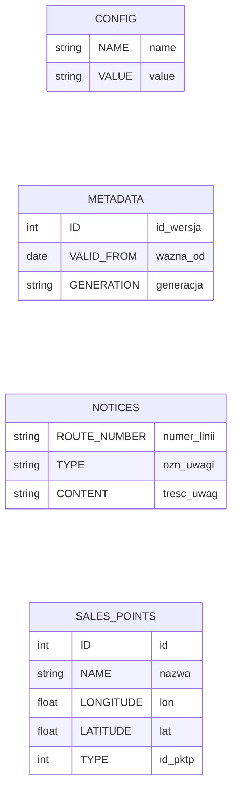
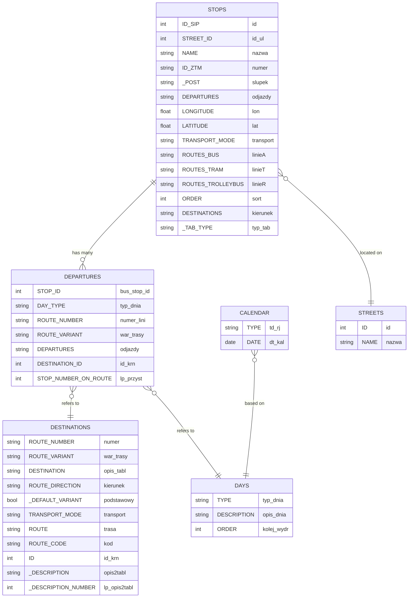

Database diagrams has been constructed on this assumption.

| Type   | Parsed Name | Original Name |
| ------ | ----------- | ------------- |
| string | Example     | ex            |

## "Loose" Tables

## Related Tables

