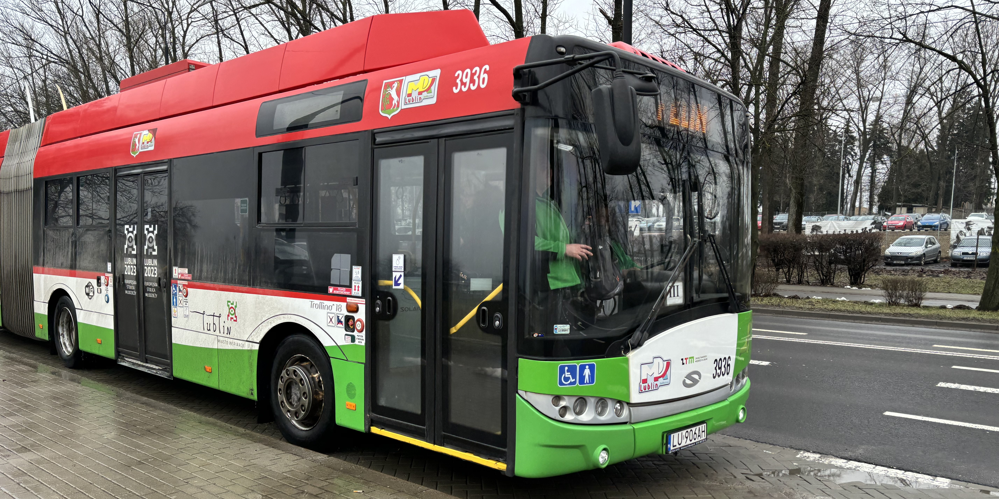

Here are some terms specific to public transit used in context of this project.

## Side Number

De facto id of a vehicle. Name comes from the fact that often this number is on the side of vehicle.

For example, the trolleybus in the image has a side number of `3936`.

## Brigade

A logistical grouping of vehicles assigned to work on a specific day. A single vehicle within a brigade may operate on multiple routes throughout the day.
