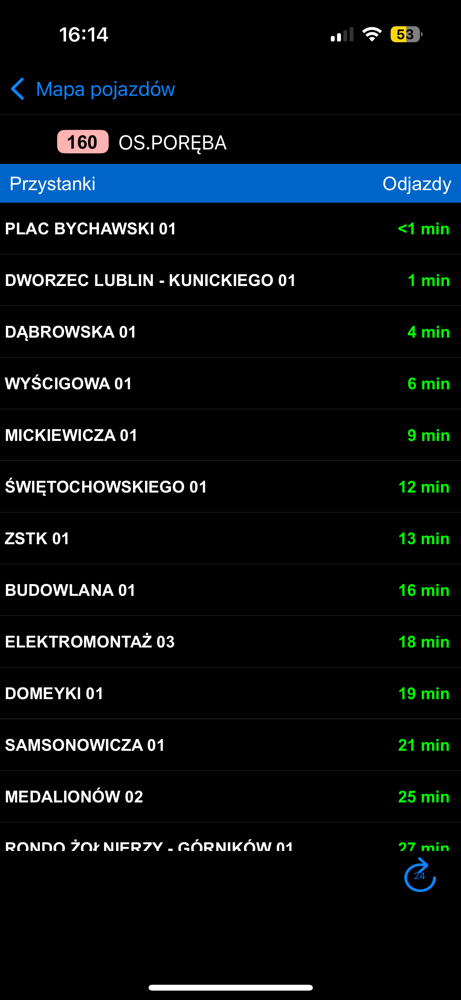

## Endpoint

```
${BASE}/GetVehicleTimeTable
```

## Logic

This API call is mainly used for the purposes of displaying next stops on vehicle's route.



## Params

-   `nNb` - Vehicle's side number (id)

## API Response Type

```ts
const _example = {
    lp: '32', // Stop number on route
    id: '515', // SIP id of stop
    name: 'BOCIANIA 01', // Stop full name
    th: '', // If no tracking available or departure is distant string of departure hour else empty
    // If no tracking available or departure is distant string of departure minute
    // Else string label of minutes <1 min / x min
    tm: '1 min',
    s: '88', // Estimated seconds to arrive
    m: '2', // Status
};

export type TimeTableVehicleStopApi = typeof _example;
export type TimeTableVehicleApi = {
    Schedules: {
        id: string; // ? id used for route-variant, but different from db
        nr: string; // Route number
        type: string; // Route variant
        o: string; // Route Destination
        Stop?: TimeTableVehicleStopApi | TimeTableVehicleStopApi[];
    };
};
```

## Parsed Type

```ts
export type VehicleStopInfo = {
    stop: {
        numberEnRoute: number;
        idSip: number;
        name: string;
    };
    time: {
        label: string;
        seconds: number;
    };
    status: TrackingStatus;
};

export type TimetableVehicle = {
    id: number;
    route: {
        number: string;
        variant: string;
        destination: string;
    };
    stops: VehicleStopInfo[];
};
```
:::note
This file refers to [`Common Types`](../../../common)
:::