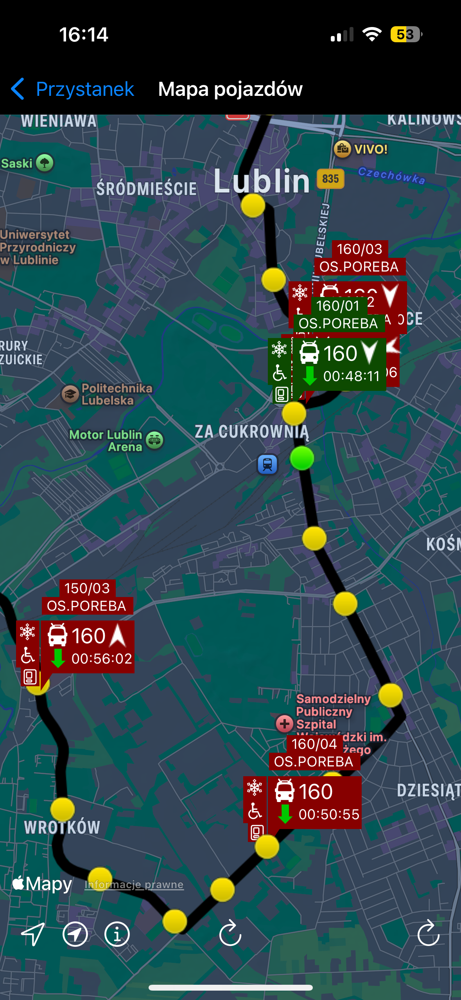
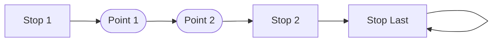

## Endpoint

```
${BASE}/GetRouteVariantWithTransitPoints
```

## Logic

This endpoint is used to build the map from this view.



Body of a response is a list that can be represented as this graph



There is one frustrating thing about the point list. It can start either from 0 OR 1.

## Params

-
-   `cRoute` - Route Number e.g. 160
-   `cRouteVariant` - Route Variant e.g. B

## API Response Type

```ts
const _pointExample = {
    'l': '1', // Number in sequence
    'x': '22.50211', // Longitude
    'y': '51.22122', // Latitude
};
const _shape = {
    'Pkt': [_pointExample], // Route points i1 -> Pkt[] -> i2
    'i1': '570', // This point id SIP
    'i2': '518', // Next point id SIP - when last id1=id2 & Pkt not present
    'r': '160', // Route Number
    't': 'A', // Route Variant
};
export type TransitPointApi = typeof _pointExample;
export type RouteTransitPointsApi = {
    R: {
        T: {
            Pkt?: TransitPointApi | TransitPointApi[];
            i1: string;
            i2: string;
        }[];
    };

    r: string;
    t: string;
};
```

## Parsed Type

```ts
export const ROUTE_ELEMENT = {
    STOP: 'stop',
    POINT: 'point',
} as const;

export type RouteElement = ValuesToKeys<typeof ROUTE_ELEMENT>; // 'stop' | 'point'

export type RoutePoint = {
    type: typeof ROUTE_ELEMENT.POINT;
    position: Position;
};

export type RouteStop = {
    type: typeof ROUTE_ELEMENT.STOP;
    id: number;
};
export type TransitPoint = RouteStop | RoutePoint;
export type RouteTransitPoints = {
    route: {
        number: Route['number'];
        variant: Route['variant'];
    };
    points: TransitPoint[];
};
```

:::note
This file refers to [`Common Types`](../../../common)
:::
