This project aims to reverse engineer the MyBus mobile app to understand its inner workings. Let's begin by understanding the app itself.

## Creators

The MyBus app was created by [PZI Taran](http://www.taran.com.pl/?pl/about), a Polish programming firm specializing in public transit and passenger information systems.

A key partner is R&G, another Polish firm that collaborated with and later [merged with](http://www.rg.com.pl/plan_pol.pdf) PZI Taran. R&G designs the electronics used in public transit vehicles, forming a unified system for both monitoring (operators) and passenger information.

## Goal of the app

Simply put, the MyBus app provides public transit users with data collected by R&G devices.

## R&G "architecture" overview

```mermaid
flowchart LR

subgraph veh1 ["🚍 Vehicle 1 (Bus)"]
    direction BT
    SIM1["📶 SIM card"]
    GPS1["📍🗺️ GPS"]
    DISP1["🖥️ Displays"]
    DRI1["⚙️ On-board computer"]
    DRI1 <--> SIM1 & GPS1 & DISP1
end

subgraph veh2 ["🚊 Vehicle 2 (Tram)"]
    direction BT
    SIM2["📶 SIM card"]
    GPS2["📍🗺️ GPS"]
    DISP2["🖥️ Displays"]
    DRI2["⚙️ On-board computer"]
    DRI2 <--> SIM2 & GPS2 & DISP2

end

subgraph veh3 ["🚎 Vehicle 3 (Trolleybus)"]
    direction BT
    SIM3["📶 SIM card"]
    GPS3["📍🗺️ GPS"]
    DISP3["🖥️ Displays"]
    DRI3["⚙️ On-board computer"]
    DRI3 <--> SIM3 & GPS3 & DISP3
end


subgraph city ["🏙️ City's server"]
    mobile["📞 Mobile service"]
    admin["🛠️ Admin service"]
    private["🔐 Private service"]
    public["🌐 Public service"]

end


subgraph udesktop ["💻 Desktop User"]
end
subgraph uadmin ["👩🏻‍💻 Administrator"]
end

subgraph stop ["🚍🚏 Stop"]
    DISP4["🖥️ Display"]
end

subgraph umobile ["📱 Mobile User"]
end


mobile <-->|HTTP| umobile
public  -->|HTTP| stop & udesktop
admin <-->|HTTP| uadmin
veh1 & veh2 & veh3  <-->|HTTP| private
```

This is classic Client-Server architecture. Each city has a dedicated server hosting services that handle HTTP requests from users (vehicles, stops, and passengers). Most communication occurs via SOAP (XML) rather than REST and JSON.

Vehicle communication with the outside world is managed by devices like the R&G SRG-6000:

This device also controls onboard displays, voice messages, and ticket machine status - essentially acting as a "data generator" sending information to be displayed for users.

## Mobile app logic

1.  **City Selection & Database Download:** When a user first launches the app, they are prompted to select a city. This triggers the download of a local schedule database for that city.
2.  **Online vs. Offline Mode:** The app operates in either online or offline mode:
    -   **Offline Mode:** The app displays data exclusively from the downloaded schedule database.
    -   **Online Mode:** The app combines data from the local database with real-time data retrieved from the server via API calls. _Crucially, the app never mixes data from these two sources within the same display._
